# Entry-Test-Guru: High-Level Technical Architecture

## Features (MVP)

### Authentication & Multi-Device Session Management
Comprehensive user authentication system supporting Google, Facebook, phone, and email/password authentication with strict 3-device limit enforcement (iPhone and iPad count as separate devices) using Device Info Plus package for device fingerprinting and basic session management with 2-3 minute polling synchronization across platforms.

#### Tech Involved
* Firebase Auth for authentication services
* FastAPI JWT token management service
* Firebase Firestore for session tracking
* Device Info Plus Flutter package for device fingerprinting
* Firebase Cloud Messaging for session invalidation notifications

#### Main Requirements
* Device fingerprinting must uniquely identify each platform using Device Info Plus package (iPhone and iPad count as separate devices)
* Session invalidation must propagate to all active devices through polling every 2-3 minutes
* Anonymous user sessions must seamlessly convert to authenticated sessions with data preservation
* Basic session management with polling synchronization, no real-time connections for session management
* Automatic session cleanup for inactive devices after 30 days
* Sprint Exams and Simulated Real Exams are device-locked once started

### Question Bank Management System
Scalable question delivery system with CSV bulk import, admin interface for content management, and intelligent question selection based on difficulty progression and user performance using PostgreSQL with full-text search capabilities.

#### Tech Involved
* FastAPI microservice for question CRUD operations
* Firebase Cloud Storage for image/video assets
* PostgreSQL for structured question data with full-text search capabilities
* Pandas for CSV processing and validation
* Firebase Admin SDK for batch operations

#### Main Requirements
* CSV import must validate question format, detect duplicates, and handle malformed data gracefully
* Question images must be automatically optimized for mobile (WebP) and desktop (multiple resolutions)
* Admin interface must support bulk editing, question preview, and approval workflows
* Question selection algorithm must balance difficulty progression with weak topic reinforcement
* Content delivery must be cached at CDN level with 24-hour TTL for performance
* PostgreSQL full-text search for advanced question filtering and content discovery

### Adaptive Sprint Examination System
Timed practice sessions with configurable question counts, client-side timer precision with millisecond accuracy, and seamless integration with analytics for difficulty adjustment and detailed timing analysis.

#### Tech Involved
* FastAPI service for sprint session management
* Firebase Firestore for sprint session persistence
* React-like state management in Flutter using Riverpod
* Client-side timer with millisecond precision using Flutter's Stopwatch
* Firebase Cloud Functions for sprint result processing

#### Main Requirements
* Timer must maintain millisecond precision using client-side mechanisms with backup validation
* Sprint sessions must be resumable with exact time remaining and question state preservation on the same device
* Ad display timing must be excluded from sprint timers through precise timestamp tracking
* Sprint results must trigger analytics updates within 2-3 minutes of completion
* Sprint sessions are device-locked once started to maintain session integrity
* Individual question response times tracked with millisecond precision for advanced analytics

### Real-Time Analytics & Performance Tracking
Comprehensive user performance analytics with regression detection, peer comparisons, timing analytics, and personalized insights generation for adaptive learning recommendations with 2-3 minute update cycles.

#### Tech Involved
* Firebase Analytics for user behavior tracking
* FastAPI analytics microservice with background job processing
* PostgreSQL for historical performance data with time-series optimization
* Firebase Cloud Functions for analytics processing
* Chart.js integration in Flutter web for data visualization
* Celery with Redis for asynchronous analytics processing (removed, using Firebase Cloud Functions only)

#### Main Requirements
* Performance regression detection must analyze rolling 30-day windows with statistical significance testing
* Peer comparison calculations must be privacy-preserving with anonymized data aggregation
* Analytics updates must complete within 2-3 minutes of sprint completion
* Historical data must be efficiently queryable for trend analysis over 6-month periods
* Millisecond-precise timing analytics for detailed performance insights and speed improvement tracking
* Analytics dashboards update through polling mechanism aligned with session synchronization

### AI-Powered Coaching & Explanation System
Intelligent tutoring system combining pre-written expert explanations with AI-powered follow-up conversations using external LLM APIs for personalized learning support.

#### Tech Involved
* FastAPI service with async LLM API integration (OpenAI, Anthropic, Gemini)
* Firebase Firestore for conversation history and explanation caching
* Content management system for expert explanations with rich media support
* Rate limiting and cost management for LLM API calls
* Firebase Cloud Storage for video explanations with adaptive streaming

#### Main Requirements
* Expert explanations must support rich media (images, equations, videos) with cross-platform rendering
* AI conversations must maintain context across multiple follow-up questions within sessions
* LLM responses must be cached intelligently to reduce API costs while maintaining personalization
* Explanation delivery must adapt to device capabilities (full video on desktop, compressed on mobile)
* Content versioning must support A/B testing of explanation effectiveness

### Social Accountability & Peer Monitoring
Consensual performance sharing system with Firebase Cloud Messaging notifications, peer comparisons, and social encouragement features to maintain study motivation and healthy competition.

#### Tech Involved
* Firebase Cloud Messaging for push notifications
* Firebase Firestore with security rules for privacy-controlled data sharing
* Flutter local notifications for cross-platform notification handling
* Privacy consent management system with granular permissions

#### Main Requirements
* Peer monitoring invitations must require explicit mutual consent with easy revocation
* Notifications delivered through Firebase Cloud Messaging as close to real-time as possible
* Performance sharing must be granular (overall progress vs detailed analytics) with user control
* Social features must comply with privacy regulations and support data deletion requests
* Notification frequency must be intelligently throttled to prevent spam while maintaining engagement

### Subscription & Payment Integration
Comprehensive monetization system with Paddle.com payment processing and subscription management, and integrated advertising system with precise timing controls.

#### Tech Involved
* Paddle.com SDK for payment processing and subscription lifecycle management
* FastAPI payment service with idempotent transaction handling
* Firebase Security Rules for subscription status enforcement
* Google AdMob integration with Flutter ad plugins
* Webhook verification and retry logic for payment events

#### Main Requirements
* Payment processing must handle failed transactions with automatic retry and user notification
* Subscription status must propagate to all user devices within 2-3 minutes of payment confirmation through polling
* Ad display must be precisely timed to exclude ad loading from practice session timers
* Subscription upgrades/downgrades must be handled seamlessly with prorated billing
* Payment webhook failures must trigger automatic reconciliation processes

### Simulated Exam Environment
High-fidelity exam simulation system replicating actual test conditions with precise timing, authentic question structures, millisecond-accurate response tracking, and comprehensive performance analysis matching real exam formats.

#### Tech Involved
* FastAPI exam orchestration service
* Firebase Firestore for exam state persistence and recovery
* Flutter full-screen mode with platform-specific kiosk implementations
* Background services for preventing interruption during exam mode
* Client-side timer with millisecond precision for accurate timing analytics
* Firebase Cloud Functions for exam scoring and analysis generation

#### Main Requirements
* Exam environment must prevent platform-specific interruptions (notifications, calls, system dialogs)
* Timing precision must be maintained with client-side backup timers achieving millisecond accuracy
* Exam sessions are device-locked once started and cannot be transferred to other devices
* Question delivery must pre-load next questions to eliminate loading delays during timed sections
* Exam results must generate detailed performance breakdowns with millisecond-precise timing analytics
* Individual question response times tracked for comprehensive speed analysis

## System Diagram

```mermaid
graph TB
    subgraph "Client Applications"
        MA[Mobile App<br/>Flutter iOS/Android]
        WA[Web App<br/>Flutter Web]
    end
    
    subgraph "Load Balancer & CDN"
        LB[Cloud Load Balancer]
        CDN[Firebase CDN]
    end
    
    subgraph "API Gateway & Authentication"
        AG[API Gateway<br/>Cloud Endpoints]
        AUTH[Firebase Auth Service]
        JWT[JWT Token Service<br/>FastAPI]
    end
    
    subgraph "Core Microservices"
        USER[User Management<br/>FastAPI]
        QUEST[Question Bank Service<br/>FastAPI]
        SPRINT[Sprint Exam Service<br/>FastAPI]
        ANA[Analytics Service<br/>FastAPI]
        AI[AI Coaching Service<br/>FastAPI]
        SOCIAL[Social Features<br/>FastAPI]
        PAY[Payment Service<br/>FastAPI]
        EXAM[Exam Simulation<br/>FastAPI]
    end
    
    subgraph "Notification Services"
        FCM[Firebase Cloud Messaging]
        NOTIF[Notification Service<br/>FastAPI]
    end
    
    subgraph "Data Storage"
        FS[Firebase Firestore<br/>User Data & Sessions]
        PSQL[PostgreSQL<br/>Question Bank & Analytics<br/>with Full-Text Search]
        STORAGE[Firebase Cloud Storage<br/>Media Assets]
        REDIS[Redis Cache<br/>Session & Performance Data]
    end
    
    subgraph "Background Processing"
        CF[Firebase Cloud Functions<br/>Analytics & Background Jobs]
        SCHEDULER[Cloud Scheduler<br/>Periodic Tasks]
    end
    
    subgraph "External APIs"
        OPENAI[OpenAI/Anthropic<br/>LLM APIs]
        PADDLE[Paddle.com<br/>Payments & Subscriptions]
        GA[Google Analytics]
        ADMOB[Google AdMob]
    end
    
    subgraph "Monitoring & DevOps"
        LOG[Cloud Logging]
        MON[Cloud Monitoring]
        ERR[Error Reporting]
    end
    
    %% Client to Load Balancer
    MA --> LB
    WA --> LB
    
    %% Load Balancer to Services
    LB --> AG
    CDN --> MA
    CDN --> WA
    
    %% API Gateway Flow
    AG --> AUTH
    AG --> JWT
    AG --> USER
    AG --> QUEST
    AG --> SPRINT
    AG --> ANA
    AG --> AI
    AG --> SOCIAL
    AG --> PAY
    AG --> EXAM
    
    %% Polling Connections (2-3 minute intervals)
    MA -.->|Polling Every 2-3min| USER
    WA -.->|Polling Every 2-3min| USER
    
    %% Notification Flow
    NOTIF --> FCM
    FCM --> MA
    SOCIAL --> NOTIF
    
    %% Service to Database Connections
    USER --> FS
    USER --> REDIS
    QUEST --> PSQL
    QUEST --> STORAGE
    SPRINT --> FS
    SPRINT --> REDIS
    ANA --> PSQL
    ANA --> FS
    AI --> FS
    AI --> REDIS
    SOCIAL --> FS
    PAY --> FS
    EXAM --> FS
    EXAM --> PSQL
    
    %% Background Processing
    CF --> FS
    CF --> PSQL
    CF --> REDIS
    SCHEDULER --> CF
    
    %% External API Connections
    AI --> OPENAI
    PAY --> PADDLE
    ANA --> GA
    MA --> ADMOB
    WA --> ADMOB
    
    %% Service Interactions
    SPRINT --> ANA
    EXAM --> ANA
    USER --> SOCIAL
    ANA --> AI
    PAY --> USER
    
    %% Monitoring
    USER --> LOG
    QUEST --> MON
    SPRINT --> ERR
    ANA --> LOG
    AI --> MON
    SOCIAL --> ERR
    PAY --> LOG
    EXAM --> MON
    
    %% Styling
    classDef client fill:#e1f5fe
    classDef service fill:#f3e5f5
    classDef database fill:#e8f5e8
    classDef external fill:#fff3e0
    classDef notification fill:#fce4ec
    
    class MA,WA client
    class USER,QUEST,SPRINT,ANA,AI,SOCIAL,PAY,EXAM service
    class FS,PSQL,STORAGE,REDIS database
    class OPENAI,PADDLE,GA,ADMOB external
    class FCM,NOTIF notification
```

